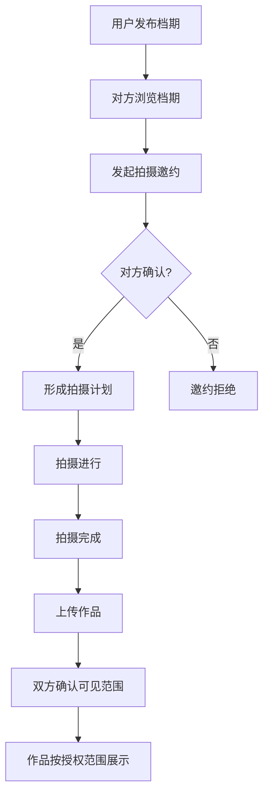
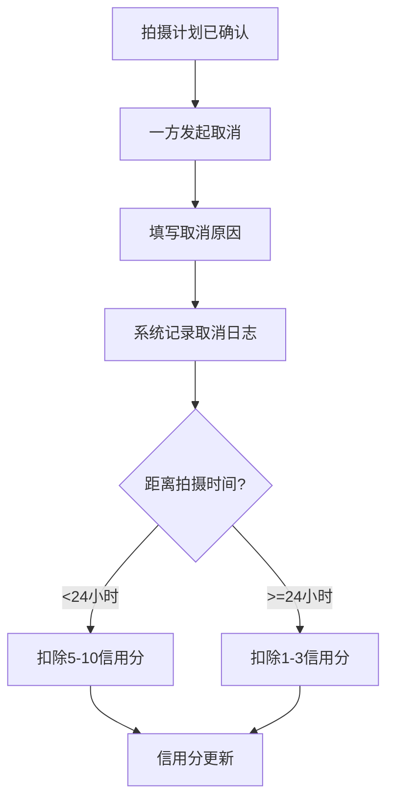

## 1. 产品概述
摄影外拍互约平台，连接摄影师与模特，提供档期发布、拍摄预约、信用管理、作品授权一体化服务。解决摄影圈外拍约拍信息不对称、信用缺失、版权不清晰等痛点。

- 目标用户：专业/业余摄影师、职业/兼职模特、摄影爱好者
- 市场价值：构建安全可信的摄影合作生态，保护创作者权益

## 2. 核心功能

### 2.1 用户角色
| 角色 | 注册方式 | 核心权限 |
|------|----------|----------|
| 摄影师 | 手机号注册 + 身份认证 | 发布档期、发起邀约、管理作品、查看模特资料 |
| 模特 | 手机号注册 + 身份认证 | 发布档期、接受邀约、管理作品集、授权照片使用 |

### 2.2 功能模块
1. **首页发现**：档期推荐、用户搜索、城市筛选、风格分类
2. **档期发布**：发布/编辑档期、设置城市/风格/费用/日期、上传样片
3. **拍摄计划**：邀约确认、行程管理、状态跟踪
4. **取消管理**：取消记录、原因填写、信用评分影响
5. **作品管理**：照片上传、可见范围确认、授权管理、公开相册
6. **个人中心**：资料编辑、信用分展示、档期管理、作品管理

### 2.3 页面详情
| 页面名称 | 模块名称 | 功能描述 |
|----------|----------|----------|
| 首页 | 档期推荐卡片 | 展示热门档期，支持城市/风格筛选 |
| 首页 | 搜索栏 | 按城市、风格、角色搜索用户和档期 |
| 档期发布页 | 表单模块 | 填写档期信息：城市、日期、风格、费用、备注 |
| 档期发布页 | 样片上传 | 多图上传、拖拽排序、预览 |
| 拍摄计划页 | 计划列表 | 显示待确认/进行中/已完成/已取消的计划 |
| 拍摄计划页 | 取消弹窗 | 填写取消原因，确认后更新信用分 |
| 作品管理页 | 照片列表 | 显示所有照片，标注授权状态 |
| 作品管理页 | 授权弹窗 | 选择可见范围（私有/双方可见/公开） |
| 个人中心页 | 资料卡片 | 头像、昵称、身份标签、信用分 |
| 个人中心页 | 作品集 | 展示已授权公开的作品 |
| 用户详情页 | 资料展示 | 展示对方资料、档期、公开作品 |
| 用户详情页 | 邀约按钮 | 发起拍摄邀约 |

## 3. 核心流程

### 3.1 档期发布与邀约流程
用户发布档期 → 对方浏览档期 → 发起拍摄邀约 → 双方确认 → 形成拍摄计划 → 拍摄完成 → 上传作品 → 双方确认可见范围

### 3.2 取消与信用流程
拍摄计划生成 → 一方发起取消 → 填写取消原因 → 系统记录 → 更新信用分

## 4. 用户界面设计

### 4.1 设计风格
- **主色调**：深炭灰 `#1a1a1a` 作为背景，营造专业摄影氛围
- **点缀色**：暖金色 `#d4af37` 突出关键操作和高品质感
- **辅助色**：米白色 `#f5f0e6` 用于文字和卡片背景
- **字体**：标题使用 Playfair Display（优雅衬线），正文使用 Inter（现代无衬线）
- **按钮风格**：圆角 8px，悬停时有微妙的金色光晕效果
- **布局风格**：卡片式布局，大量留白，强调作品图片展示
- **图标风格**：线性图标，统一 2px 描边

### 4.2 页面设计概述
| 页面名称 | 模块名称 | UI 元素 |
|----------|----------|---------|
| 首页 | 档期推荐卡片 | 大图背景卡片，悬浮显示用户头像、档期信息、标签 |
| 首页 | 筛选栏 | 横向滚动标签，金色高亮选中项 |
| 档期发布页 | 表单 | 深色背景，金色描边输入框，优雅的聚焦动效 |
| 个人中心 | 信用展示 | 金色环形进度条展示信用分 |
| 作品管理 | 照片网格 | 瀑布流布局，悬停显示授权状态标识 |
| 拍摄计划 | 时间线 | 垂直时间线展示计划状态流转 |

### 4.3 响应式
- Desktop-first 设计，断点 1024px / 768px / 480px
- 桌面端：三栏布局，侧边栏导航 + 主内容区 + 信息面板
- 平板端：两栏布局，底部导航栏
- 移动端：单栏布局，底部标签导航，触摸友好的大点击区域

### 4.4 动效设计
- 页面加载：卡片错落淡入，金色边框渐变描边动画
- 悬停效果：图片微放大，金色光晕扩散
- 滚动效果：导航栏毛玻璃渐变效果
- 状态切换：拍摄计划状态变更时的金色脉冲动画
