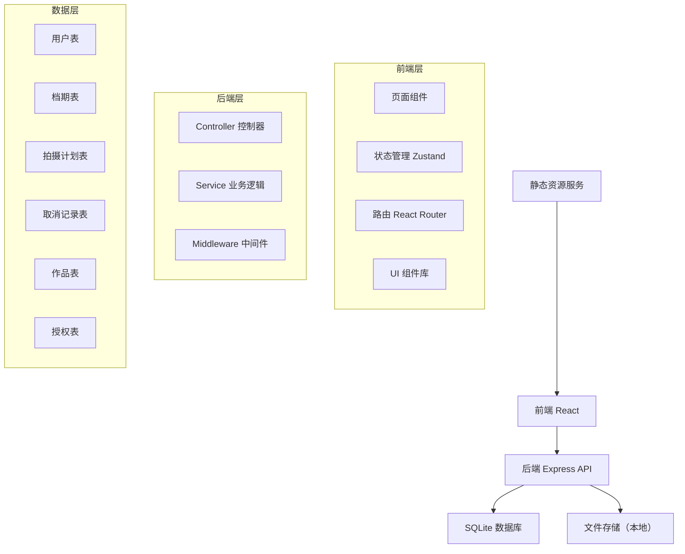
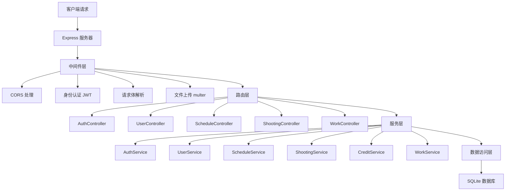
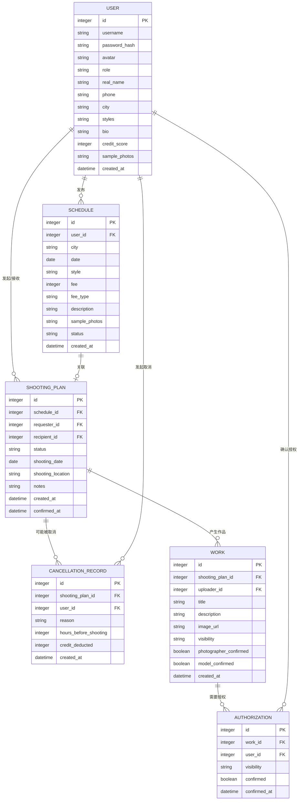

## 1. 架构设计



## 2. 技术描述
- **前端**：React@18 + TypeScript + Vite + tailwindcss@3 + zustand + react-router-dom + lucide-react
- **初始化工具**：vite-init
- **后端**：Express@4 + TypeScript + better-sqlite3
- **数据库**：SQLite（本地文件存储，便于开发演示）
- **状态管理**：Zustand 管理用户、档期、拍摄计划、作品等全局状态
- **文件上传**：multer 处理图片上传，本地存储

## 3. 路由定义

| 前端路由 | 页面 | 权限 |
|----------|------|------|
| / | 首页 | 公开 |
| /login | 登录页 | 公开 |
| /register | 注册页 | 公开 |
| /schedule | 档期列表 | 登录用户 |
| /schedule/publish | 发布档期 | 登录用户 |
| /schedule/:id | 档期详情 | 登录用户 |
| /shooting | 拍摄计划 | 登录用户 |
| /works | 作品管理 | 登录用户 |
| /works/:id | 作品详情 | 根据授权范围 |
| /profile | 个人中心 | 登录用户 |
| /user/:id | 用户详情 | 登录用户 |

| 后端 API 路由 | 方法 | 功能 |
|---------------|------|------|
| /api/auth/login | POST | 用户登录 |
| /api/auth/register | POST | 用户注册 |
| /api/users/:id | GET | 获取用户信息 |
| /api/users/:id | PUT | 更新用户信息 |
| /api/schedules | GET | 获取档期列表 |
| /api/schedules | POST | 发布档期 |
| /api/schedules/:id | GET | 获取档期详情 |
| /api/shootings | GET | 获取拍摄计划列表 |
| /api/shootings | POST | 创建拍摄邀约 |
| /api/shootings/:id/confirm | POST | 确认拍摄计划 |
| /api/shootings/:id/cancel | POST | 取消拍摄计划 |
| /api/works | GET | 获取作品列表 |
| /api/works | POST | 上传作品 |
| /api/works/:id/authorize | POST | 设置作品授权范围 |

## 4. API 定义

```typescript
// 用户类型
interface User {
  id: number;
  username: string;
  avatar: string;
  role: 'photographer' | 'model';
  realName: string;
  phone: string;
  city: string;
  styles: string[];
  bio: string;
  creditScore: number;
  samplePhotos: string[];
  createdAt: string;
}

// 档期类型
interface Schedule {
  id: number;
  userId: number;
  user: User;
  city: string;
  date: string;
  style: string;
  fee: number;
  feeType: 'free' | 'paid' | 'negotiable';
  description: string;
  samplePhotos: string[];
  status: 'active' | 'booked' | 'expired';
  createdAt: string;
}

// 拍摄计划类型
interface ShootingPlan {
  id: number;
  scheduleId: number;
  schedule: Schedule;
  requesterId: number;
  requester: User;
  recipientId: number;
  recipient: User;
  status: 'pending' | 'confirmed' | 'completed' | 'cancelled';
  shootingDate: string;
  shootingLocation: string;
  notes: string;
  createdAt: string;
  confirmedAt: string | null;
}

// 取消记录类型
interface CancellationRecord {
  id: number;
  shootingPlanId: number;
  userId: number;
  reason: string;
  hoursBeforeShooting: number;
  creditDeducted: number;
  createdAt: string;
}

// 作品类型
interface Work {
  id: number;
  shootingPlanId: number;
  uploaderId: number;
  title: string;
  description: string;
  imageUrl: string;
  visibility: 'private' | 'both' | 'public';
  photographerConfirmed: boolean;
  modelConfirmed: boolean;
  createdAt: string;
}

// 授权记录类型
interface Authorization {
  id: number;
  workId: number;
  userId: number;
  visibility: 'private' | 'both' | 'public';
  confirmed: boolean;
  confirmedAt: string | null;
}
```

## 5. 服务器架构图



## 6. 数据模型

### 6.1 数据模型定义



### 6.2 数据定义语言

```sql
-- 用户表
CREATE TABLE users (
    id INTEGER PRIMARY KEY AUTOINCREMENT,
    username VARCHAR(50) UNIQUE NOT NULL,
    password_hash VARCHAR(255) NOT NULL,
    avatar VARCHAR(255),
    role VARCHAR(20) NOT NULL CHECK (role IN ('photographer', 'model')),
    real_name VARCHAR(100) NOT NULL,
    phone VARCHAR(20) UNIQUE NOT NULL,
    city VARCHAR(100),
    styles TEXT,
    bio TEXT,
    credit_score INTEGER DEFAULT 100,
    sample_photos TEXT,
    created_at DATETIME DEFAULT CURRENT_TIMESTAMP
);

-- 档期表
CREATE TABLE schedules (
    id INTEGER PRIMARY KEY AUTOINCREMENT,
    user_id INTEGER NOT NULL REFERENCES users(id),
    city VARCHAR(100) NOT NULL,
    date DATE NOT NULL,
    style VARCHAR(50) NOT NULL,
    fee INTEGER DEFAULT 0,
    fee_type VARCHAR(20) NOT NULL DEFAULT 'negotiable' CHECK (fee_type IN ('free', 'paid', 'negotiable')),
    description TEXT,
    sample_photos TEXT,
    status VARCHAR(20) DEFAULT 'active' CHECK (status IN ('active', 'booked', 'expired')),
    created_at DATETIME DEFAULT CURRENT_TIMESTAMP
);

-- 拍摄计划表
CREATE TABLE shooting_plans (
    id INTEGER PRIMARY KEY AUTOINCREMENT,
    schedule_id INTEGER REFERENCES schedules(id),
    requester_id INTEGER NOT NULL REFERENCES users(id),
    recipient_id INTEGER NOT NULL REFERENCES users(id),
    status VARCHAR(20) DEFAULT 'pending' CHECK (status IN ('pending', 'confirmed', 'completed', 'cancelled')),
    shooting_date DATE NOT NULL,
    shooting_location VARCHAR(255),
    notes TEXT,
    created_at DATETIME DEFAULT CURRENT_TIMESTAMP,
    confirmed_at DATETIME
);

-- 取消记录表
CREATE TABLE cancellation_records (
    id INTEGER PRIMARY KEY AUTOINCREMENT,
    shooting_plan_id INTEGER NOT NULL REFERENCES shooting_plans(id),
    user_id INTEGER NOT NULL REFERENCES users(id),
    reason TEXT NOT NULL,
    hours_before_shooting INTEGER NOT NULL,
    credit_deducted INTEGER NOT NULL DEFAULT 0,
    created_at DATETIME DEFAULT CURRENT_TIMESTAMP
);

-- 作品表
CREATE TABLE works (
    id INTEGER PRIMARY KEY AUTOINCREMENT,
    shooting_plan_id INTEGER REFERENCES shooting_plans(id),
    uploader_id INTEGER NOT NULL REFERENCES users(id),
    title VARCHAR(255),
    description TEXT,
    image_url VARCHAR(255) NOT NULL,
    visibility VARCHAR(20) DEFAULT 'private' CHECK (visibility IN ('private', 'both', 'public')),
    photographer_confirmed BOOLEAN DEFAULT 0,
    model_confirmed BOOLEAN DEFAULT 0,
    created_at DATETIME DEFAULT CURRENT_TIMESTAMP
);

-- 授权表
CREATE TABLE authorizations (
    id INTEGER PRIMARY KEY AUTOINCREMENT,
    work_id INTEGER NOT NULL REFERENCES works(id),
    user_id INTEGER NOT NULL REFERENCES users(id),
    visibility VARCHAR(20) NOT NULL CHECK (visibility IN ('private', 'both', 'public')),
    confirmed BOOLEAN DEFAULT 0,
    confirmed_at DATETIME,
    created_at DATETIME DEFAULT CURRENT_TIMESTAMP
);

-- 创建索引
CREATE INDEX idx_schedules_user_id ON schedules(user_id);
CREATE INDEX idx_schedules_city ON schedules(city);
CREATE INDEX idx_schedules_date ON schedules(date);
CREATE INDEX idx_shooting_plans_requester ON shooting_plans(requester_id);
CREATE INDEX idx_shooting_plans_recipient ON shooting_plans(recipient_id);
CREATE INDEX idx_shooting_plans_status ON shooting_plans(status);
CREATE INDEX idx_works_shooting_plan ON works(shooting_plan_id);
CREATE INDEX idx_works_visibility ON works(visibility);
```
